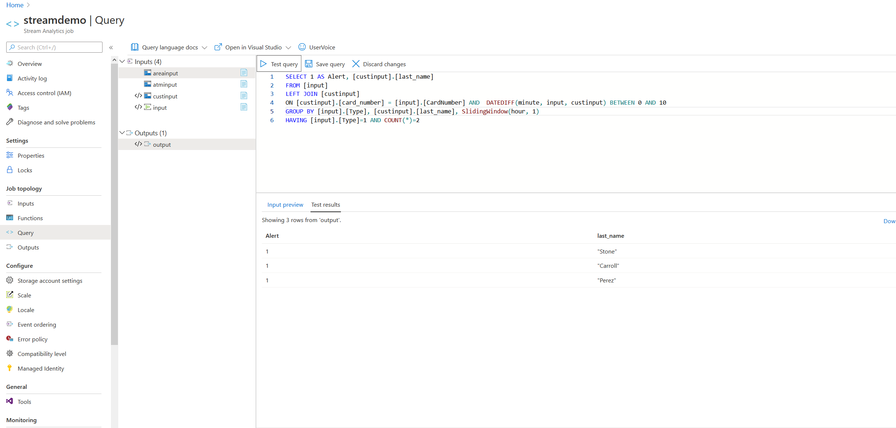

## Azure Stream Analytics Assignment 

You are going to use Azure Stream Analytics to process a data stream of ATM transactions and answer stream queries. The schema of the stream is: (ATMCode, CardNumber, Type, Amount)

1.  Create a trial account at: https://azure.microsoft.com/en-us/
2.	Setup an Event Hub.
3.	Generate a Security Access Signature: https://github.com/sandrinodimattia/RedDog/releases
4.	Edit Generator.html (open with notepad) and update the CONFIG variables with your security access signature.
5.	Feed the Event Hub with the use of Generator.html (Open Generator.html in a web browser and press the “Send Data” button.)
6.	Setup a Storage account.
7.	Upload the Reference Data files to your storage account (the How-To presentation will be updated to include reference data material.)
8.	Setup a Stream Analytics Job.
9.	Use the Event Hub + Reference Data Files as Input.
10.	Create a Blob Storage Output.
11.	Run the following queries:

**Query 1:**
Show the total “Amount” of “Type = 0” transactions at “ATM Code = 21” of the last 10 minutes. Repeat as new events keep flowing in (use a sliding window).
```
SELECT SUM(Amount) AS Total
INTO [output]
FROM [input]
TIMESTAMP BY EventEnqueuedUtcTime
GROUP BY Type, ATMCode, SlidingWindow(minute, 10)
HAVING Type = 0 AND ATMCode = 21
```


**Query 2:**
Show the total “Amount” of “Type = 1” transactions at “ATM Code = 21” of the last hour. Repeat once every hour (use a tumbling window).
```
SELECT SUM(Amount) AS Total
INTO [output]
FROM [input]
TIMESTAMP BY EventEnqueuedUtcTime
GROUP BY Type, ATMCode, TumblingWindow(hour, 1)
HAVING Type = 1 AND ATMCode = 21
```


**Query 3:**
Show the total “Amount” of “Type = 1” transactions at “ATM Code = 21” of the last hour. Repeat once every 30 minutes (use a hopping window).
```
SELECT SUM(Amount) AS Total
INTO [output]
FROM [input]
TIMESTAMP BY EventEnqueuedUtcTime
GROUP BY Type, ATMCode, HoppingWindow(minute, 60, 30)
HAVING Type = 1 AND ATMCode = 21
```


**Query 4:**
Show the total “Amount” of “Type = 1” transactions per “ATM Code” of the last one hour (use a sliding window).
```
SELECT ATMCode, SUM(Amount) AS Total
FROM [input]
TIMESTAMP BY EventEnqueuedUtcTime
GROUP BY Type, ATMCode, SlidingWindow(hour, 1)
HAVING Type = 1
```


**Query 5:**
Show the total “Amount” of “Type = 1” transactions per “Area Code” of the last hour. Repeat once every hour (use a tumbling window). Assuming that it is for each customer. 
```
SELECT  [custinput].[area_code], SUM([input].[Amount]) AS Total
FROM [input]
LEFT JOIN [custinput] ON [input].[CardNumber]=[custinput].[card_number] 
                        AND  DATEDIFF(minute, input, custinput) BETWEEN 0 AND 20
GROUP BY [input].[Type], [custinput].[area_code], TumblingWindow(hour, 1)
HAVING [input].[Type] = 1
```


**Query 6:**
Show the total “Amount” per ATM’s “City” and Customer’s “Gender” of the last hour. Repeat once every hour (use a tumbling window).
```
SELECT [areainput].[area_city], [custinput].[gender], SUM([input].[Amount]) AS Total
FROM [input]
LEFT JOIN [custinput]
ON [custinput].[card_number] = [input].[CardNumber]  AND  DATEDIFF(minute, input, custinput) BETWEEN 0 AND 20
LEFT JOIN [atminput]
ON [atminput].[atm_code] = [input].[ATMCode]  AND  DATEDIFF(minute, input, atminput) BETWEEN 0 AND 10
LEFT JOIN [areainput]
ON [areainput].[area_code] = [atminput].[area_code] AND  DATEDIFF(minute, input, areainput) BETWEEN 0 AND 10
GROUP BY [areainput].[area_city], [custinput].[gender], TumblingWindow(hour, 1)
```


**Query 7:**
Alert (SELECT “1”) if a Customer has performed two transactions of “Type = 1” in a window of an hour (use a sliding window).
```
SELECT 1 AS Alert, [custinput].[last_name]
FROM [input]
LEFT JOIN [custinput]
ON [custinput].[card_number] = [input].[CardNumber] AND  DATEDIFF(minute, input, custinput) BETWEEN 0 AND 10
GROUP BY [input].[Type], [custinput].[last_name], SlidingWindow(hour, 1)
HAVING [input].[Type]=1 AND COUNT(*)=2 
```


**Query 8:**
Alert (SELECT “1”) if the “Area Code” of the ATM of the transaction is not the same as the “Area Code” of the “Card Number” (Customer’s Area Code) - (use a sliding window).
```
SELECT 1 AS Alert
FROM [input]
LEFT JOIN [custinput]
ON [custinput].[card_number] = [input].[CardNumber] AND  DATEDIFF(minute, input, custinput) BETWEEN 0 AND 10
LEFT JOIN [atminput]
ON [atminput].[atm_code] = [input].[ATMCode] AND  DATEDIFF(minute, input, atminput) BETWEEN 0 AND 10
WHERE [atminput].[area_code] <> [custinput].[area_code]
```

